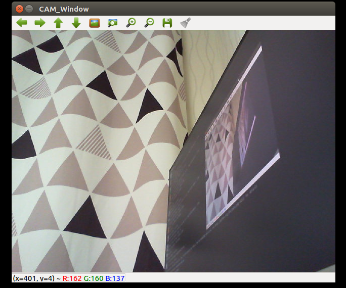

# opencv_cam_preview_c_lang_exmaple

Opencv CAM Preview Example by C Language

# How To Build a Source code

<pre><code>
$ gcc cam_preview.c -o cv_c `pkg-config opencv --libs`
</code></pre>

# How To Run the App

<pre><code>
$ ./cv_c
</code></pre>

# screenshot

